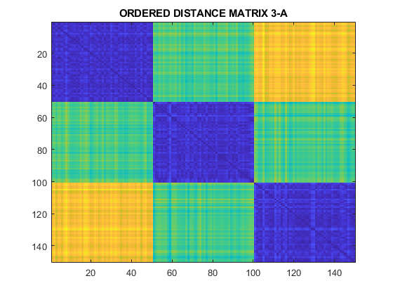

# Data Mining

## Distances and Similarities

In the distance_similarity.m file the following data is used. Where you can see the data is seperated really well from each other. Purpose of this file is understanding how distance and similarity matrixes are calculated. Firstly distance matrix is calculated by using euclidean distance method then similarity matrix is calculated by using exponential function.

Distance matrix can be seen below. 

First of all, I should mention that there are three clusters in the data that is used. Therefore clusters are aldready given. Before calculating the distance matrix, I order the data which means in the data matrix, first the label "1" is stored then "2" and "3". As we can imagine, distance of data pairs which are in the same cluster should be lower than other data pairs. That's why we can see the diagonal is blue. Blue represents the values which are closed to 0. 

Afterwards, I applied exponential function to the distance matrix with a chosen sigma. Here sigma affact the relationship of the each data point. Result can be seen below. 

In this figure, yellow represents 1. Diagonal is 0 because similarity of a point to itself is accepted 0.  When one increase the sigma value the exponential function goes zero where the overall result goes 1. In that case all the data points will be similar and connected.

